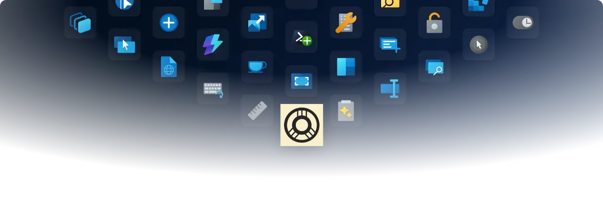
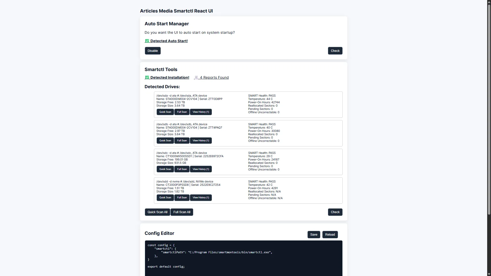

    <picture>
      <source media="(prefers-color-scheme: light)" srcset="./images/readme/pt-hero.light.webp" />
      
  </picture>

<h1 align="center">
  Articles Media Smartctl React UI
</h1>

  Articles Media Smartctl React UI allows easy usage and tracking of smartctl commands via a minimal React Vite web app.

<h3 align="center">
  <a href="./installation.md">Installation</a>
   · 
  <a href="./extensions_guide.md">Documentation</a>
   · 
  <a href="https://github.com/Articles-Media/PowerToys/releases">Release notes</a>
</h3>

## 🔨 Utilities

Articles Media PowerToys includes no useful built in utilities, add more by installing extensions from your favorite apps and creators. The following extensions are installed by default but not enabled!

  
<i>Scheduled Scans</i>

  Setup auto start and scheduled scans all from a easy to use UI.

 

  
<i>Report History</i>

  Saves important SMART statistics and provides easy to read key usage metrics. Charts available once enough reports have been ran.

 

  
<i>Easily Customizable</i>

  Uses a modern React Vite web app stack to allow fast updates and a familiar dev environment.

 

  
<i>External API & Webhook Support</i>

  Ability to send captured metrics via configured webhooks.

## 📦 Preview Photos

Preview of the softwares UI.

UI Landing Page

## 📦 Installation

For detailed installation instructions and system requirements, visit the [installation docs](./installation.md).

## 🛣️ Roadmap

- Add nickname feature to drives