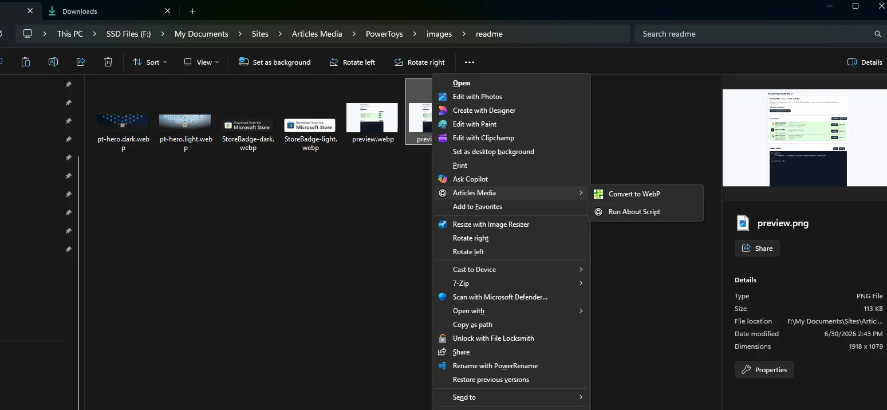
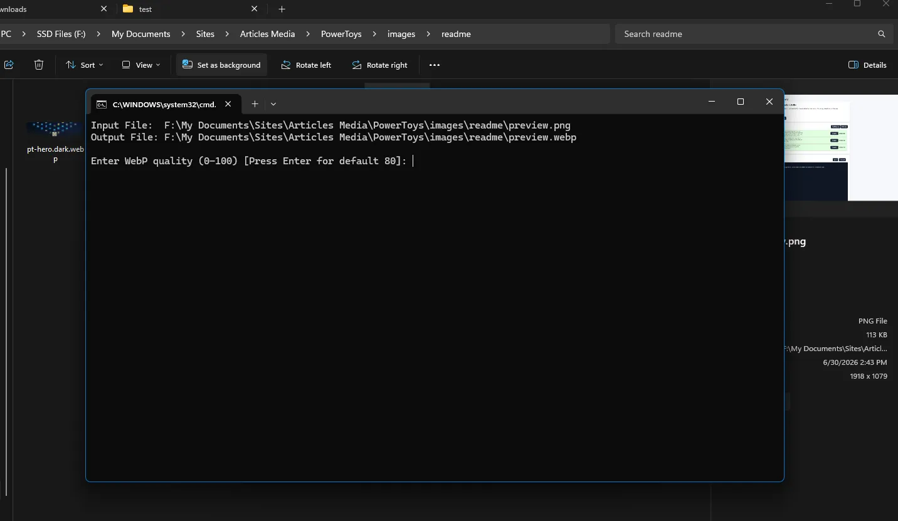
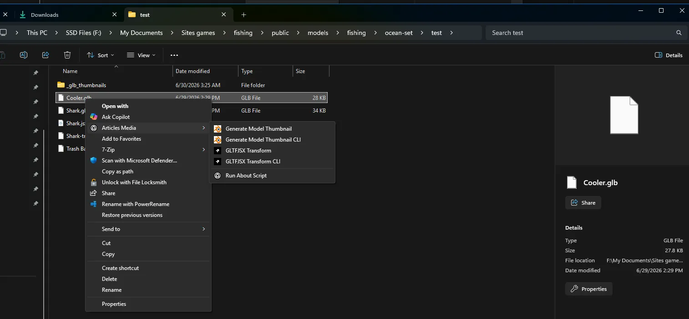

    <picture>
      <source media="(prefers-color-scheme: light)" srcset="./images/readme/pt-hero.light.webp" />
      
  </picture>

<h1 align="center">
  Articles Media Smartctl React UI
</h1>

  Similar to Microsoft PowerToys, Articles Media PowerToys allows easy creation, installation, and management of added Windows features and utilities with JavaScript. Primarily through the context menu.

<h3 align="center">
  <a href="./installation.md">Installation</a>
   · 
  <a href="./extensions_guide.md">Documentation</a>
   · 
  <a href="https://github.com/Articles-Media/PowerToys/releases">Release notes</a>
</h3>

## 🔨 Utilities

Articles Media PowerToys includes no useful built in utilities, add more by installing extensions from your favorite apps and creators. The following extensions are installed by default but not enabled!

  
<i>Articles Blender</i>

  Uses Blender to create thumbnails for 3D models from the context menu.

 

  
<i>Articles Sharp</i>

  Uses sharp to quickly allow image conversions and optimization via the context menu.

 

  
<i>Articles GLTFJSX</i>

  Transform glb and gltf to react-three-fiber ready files just by shift right clicking a model! Uses the NPM gltfjsx package!

## 📦 Preview Photos

Not much at the moment

UI Landing Page

Articles Sharp extension commands.

Further customization via command line questions.

Articles Blender & GLTFJSX extensions adding commands for 3D models.

## 📦 Installation

For detailed installation instructions and system requirements, visit the [installation docs](./installation.md).

## 🛣️ Roadmap

- More built in extensions
- Allow extensions to target folders and normal context menu without shift